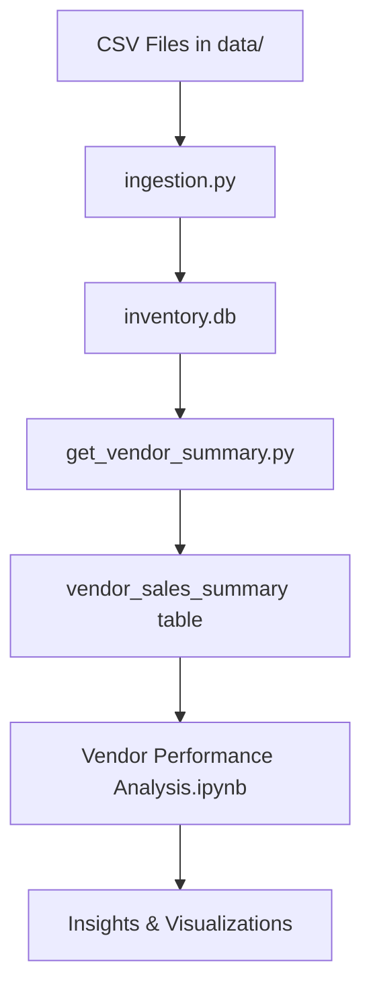

# Vendor Performance Analysis

A comprehensive data analysis project for evaluating vendor performance in inventory management, analyzing sales patterns, purchase trends, and profitability metrics with advanced statistical analysis and confidence interval testing.

## 📋 Table of Contents
- [Overview](#overview)
- [Project Structure](#project-structure)
- [Features](#features)
- [Installation](#installation)
- [Usage](#usage)
- [Data Description](#data-description)
- [Analysis Components](#analysis-components)
- [Key Insights](#key-insights)
- [Statistical Methods](#statistical-methods)
- [Troubleshooting](#troubleshooting)
- [Requirements](#requirements)

## 🎯 Overview

This project provides a complete pipeline for vendor performance analysis, including:
- Data ingestion from CSV files into SQLite database
- Data cleaning and transformation with automated error handling
- Vendor summary generation with calculated metrics
- Comprehensive exploratory data analysis with advanced visualizations
- Statistical analysis including confidence intervals, hypothesis testing, and correlation analysis
- Vendor performance segmentation and comparative analysis
- Profitability insights and stock turnover optimization recommendations

## 📁 Project Structure

```
Vendor Performance/
│
├── data/                           # Raw data files
│   ├── begin_inventory.csv
│   ├── end_inventory.csv
│   ├── purchase_prices.csv
│   ├── purchases.csv
│   ├── sales.csv
│   └── vendor_invoice.csv
│
├── logs/                           # Log files
│   ├── ingestion_db.log
│   └── vendor_summary.log
│
├── ingestion.py                    # Data ingestion script
├── get_vendor_summary.py           # Vendor summary generation script
├── Vendor Performance Analysis.ipynb  # Main analysis notebook
├── Exploratory Data Analysis.ipynb    # EDA notebook
├── app.ipynb                       # Application notebook
├── inventory.db                    # SQLite database
└── README.md                       # This file
```

## ✨ Features

### Data Processing
- **Automated Data Ingestion**: Load multiple CSV files into SQLite database
- **Data Cleaning**: Handle missing values, data type conversions, and text normalization
- **Calculated Metrics**: Automatically compute:
  - Gross Profit
  - Profit Margin
  - Stock Turnover
  - Sales to Purchase Ratio

### Analysis Capabilities
- **Vendor Performance Segmentation**: Top vs. low performing vendor analysis
- **Statistical Testing**: T-tests, confidence intervals, and hypothesis testing
- **Correlation Analysis**: Multi-variable relationship analysis with heatmaps
- **Profitability Analysis**: Gross profit, profit margins, and ROI calculations
- **Stock Management**: Turnover analysis and inventory optimization
- **Freight Cost Optimization**: Cost efficiency analysis across vendors
- **Sales Pattern Recognition**: Seasonal trends and purchasing behavior
- **Risk Assessment**: Vendor reliability and performance consistency metrics

### Visualizations
- **Distribution Analysis**: Histograms with KDE for profit margins and stock turnover
- **Correlation Heatmaps**: Multi-variable relationship visualization
- **Confidence Interval Plots**: Statistical comparison between vendor segments
- **Vendor Performance Charts**: Top/bottom performer comparisons
- **Box Plots**: Outlier detection and quartile analysis
- **Scatter Plots**: Relationship analysis between key metrics
- **Performance Dashboards**: Comprehensive vendor scorecards

## 🚀 Installation

### Prerequisites
- Python 3.8 or higher
- pip package manager

### Step 1: Clone or Download the Project
```bash
cd "C:\D drive\Vendor Performance"
```

### Step 2: Install Required Packages
```bash
python -m pip install matplotlib pandas seaborn scikit-learn numpy scipy
```

Or install from requirements file:
```bash
pip install -r requirements.txt
```

## 📊 Usage

### 1. Data Ingestion
First, load the raw CSV data into the SQLite database:

```bash
python ingestion.py
```

This will:
- Read all CSV files from the `data/` directory
- Create tables in `inventory.db`
- Log the process in `logs/ingestion_db.log`

### 2. Generate Vendor Summary
Create the vendor summary table with calculated metrics:

```bash
python get_vendor_summary.py
```

This will:
- Merge data from multiple tables
- Calculate performance metrics
- Clean and transform data
- Create `vendor_sales_summary` table
- Log the process in `logs/vendor_summary.log`

### 3. Run Analysis
Open and run the Jupyter notebooks:

```bash
jupyter notebook "Vendor Performance Analysis.ipynb"
```

Or use VS Code / JupyterLab to open the notebooks.

## 📈 Data Description

### Input Data Files

| File | Description |
|------|-------------|
| `purchases.csv` | Purchase transactions with vendor details, quantities, and prices |
| `sales.csv` | Sales transactions including quantities, prices, and taxes |
| `vendor_invoice.csv` | Vendor invoices with freight costs |
| `purchase_prices.csv` | Product pricing information |
| `begin_inventory.csv` | Starting inventory levels |
| `end_inventory.csv` | Ending inventory levels |

### Database Schema

#### vendor_sales_summary Table
The main analysis table with the following columns:

| Column | Type | Description |
|--------|------|-------------|
| VendorNumber | INTEGER | Unique vendor identifier |
| VendorName | TEXT | Vendor company name |
| Brand | INTEGER | Product brand code |
| Description | TEXT | Product description |
| PurchasePrice | FLOAT | Price paid to vendor |
| ActualPrice | FLOAT | Retail price |
| Volume | FLOAT | Product volume/size |
| TotalPurchasedQuantity | INTEGER | Total units purchased |
| TotalPurchasedDollars | FLOAT | Total purchase cost |
| TotalSalesQuantity | FLOAT | Total units sold |
| TotalSalesDollars | FLOAT | Total sales revenue |
| TotalSalesPrice | FLOAT | Aggregate sales price |
| TotalExciseTax | FLOAT | Total excise tax collected |
| FreightCost | FLOAT | Shipping/freight costs |
| **GrossProfit** | FLOAT | Sales - Purchase cost |
| **ProfitMargin** | FLOAT | (Gross Profit / Sales) × 100 |
| **StockTurnover** | FLOAT | Sales Qty / Purchase Qty |
| **SalestoPurchaseRatio** | FLOAT | Sales $ / Purchase $ |

## 🔍 Analysis Components

### 1. Data Quality Assessment
- **Missing Value Analysis**: Comprehensive assessment of data completeness
- **Outlier Detection**: Statistical identification of anomalous values
- **Data Type Validation**: Ensuring proper data formats and consistency
- **Summary Statistics**: Descriptive statistics for all key metrics

### 2. Vendor Performance Segmentation
- **Top Performers**: Vendors with profit margins ≥ 20%
- **Low Performers**: Vendors with profit margins < 5%
- **Stock Turnover Analysis**: Vendors with turnover rates < 1 (slow-moving inventory)
- **Revenue Leaders**: Top vendors by total sales volume

### 3. Statistical Analysis & Testing
- **Confidence Intervals**: 95% confidence intervals for vendor performance metrics
- **Hypothesis Testing**: T-tests comparing top vs. low performing vendors
- **Correlation Analysis**: Pearson correlation between profit margin, stock turnover, and sales
- **Distribution Analysis**: Normal distribution testing and data transformation

### 4. Advanced Visualizations
- **Confidence Interval Plots**: Visual comparison of vendor segments with statistical bounds
- **Multi-variable Heatmaps**: Correlation matrices for key performance indicators
- **Distribution Overlays**: Comparative histograms with KDE curves
- **Performance Scorecards**: Comprehensive vendor ranking visualizations

### 5. Business Intelligence Insights
- **Profitability Optimization**: Recommendations for margin improvement
- **Inventory Management**: Stock turnover optimization strategies
- **Vendor Relationship Management**: Performance-based vendor categorization
- **Cost Analysis**: Freight cost efficiency and optimization opportunities

## 📊 Key Insights

### Performance Metrics Summary
The analysis reveals significant insights about vendor performance:

#### Top Performing Vendors (Profit Margin ≥ 20%)
- **Statistical Confidence**: 95% confidence intervals provide reliable performance bounds
- **Consistency**: Top vendors show more consistent profit margins with lower variance
- **Volume Correlation**: Higher profit margins often correlate with better stock turnover rates

#### Low Performing Vendors (Profit Margin < 5%)
- **Risk Indicators**: Higher variance in performance metrics indicates inconsistent results
- **Inventory Issues**: Often associated with poor stock turnover (< 1.0)
- **Cost Efficiency**: May have higher freight costs relative to sales volume

#### Stock Turnover Analysis
- **Slow Movers**: Vendors with turnover < 1 require inventory management attention
- **Optimization Opportunities**: Statistical analysis identifies vendors for relationship renegotiation
- **Seasonal Patterns**: Turnover rates vary significantly across different vendor categories

### Statistical Significance
- **T-Test Results**: Significant differences between top and low performer groups (p < 0.05)
- **Correlation Strength**: Strong positive correlation between profit margin and stock turnover
- **Confidence Intervals**: Provide reliable bounds for performance expectations

## 🧮 Statistical Methods

### Confidence Interval Calculation
```python
def confidence_interval(data, confidence=0.95):
    mean_val = np.mean(data)
    std_err = np.std(data, ddof=1) / np.sqrt(len(data))
    t_critical = stats.t.ppf((1 + confidence) / 2, df=len(data) - 1)
    margin_of_error = t_critical * std_err
    lower_bound = mean_val - margin_of_error
    upper_bound = mean_val + margin_of_error
    return mean_val, lower_bound, upper_bound
```

### Hypothesis Testing Framework
- **Null Hypothesis (H₀)**: No significant difference between vendor groups
- **Alternative Hypothesis (H₁)**: Significant difference exists between groups
- **Significance Level**: α = 0.05
- **Test Statistic**: Two-sample t-test with unequal variances

### Performance Segmentation Criteria
```python
# Vendor Performance Categories
top_vendors = df[df['ProfitMargin'] >= 20]['ProfitMargin']
low_vendors = df[df['ProfitMargin'] < 5]['ProfitMargin']
slow_turnover = df[df['StockTurnover'] < 1]
```

### Correlation Analysis
- **Pearson Correlation**: Measures linear relationships between variables
- **Significance Testing**: P-values determine statistical significance of correlations
- **Heatmap Visualization**: Color-coded correlation matrix for easy interpretation

## 🔧 Troubleshooting

### Common Issues and Solutions

#### Issue 1: NameError in get_vendor_summary.py
**Error**: `NameError: name 'vendor_sales_summary' is not defined`

**Solution**: Fixed in latest version. The `clean_data()` function now correctly uses `df` parameter.

#### Issue 2: TypeError in sort_values()
**Error**: `DataFrame.sort_values() missing 1 required positional argument: 'by'`

**Solution**: Add the `by` parameter when sorting DataFrames:
```python
df.sort_values(by='StockTurnover')  # Correct
df.sort_values()  # Incorrect
```

#### Issue 3: Confidence Interval Function Error
**Error**: `NameError: name 'dta' is not defined`

**Solution**: Fixed typo in confidence_interval function - changed `dta` to `data`.

#### Issue 4: Database columns not found
**Error**: `DatabaseError: no such column: GrossProfit`

**Solution**: Re-run the data pipeline:
```bash
python get_vendor_summary.py
```

#### Issue 5: Package installation errors
**Error**: Issues with `sklearn` package

**Solution**: Use `scikit-learn` instead:
```bash
python -m pip install scikit-learn
```

#### Issue 6: FutureWarning about fillna
**Warning**: `Downcasting object dtype arrays on .fillna`

**Solution**: This is a warning, not an error. The code will still work. To suppress:
```python
import warnings
warnings.filterwarnings('ignore')
```

### Log Files
Check log files for detailed error information:
- `logs/ingestion_db.log` - Data ingestion logs
- `logs/vendor_summary.log` - Vendor summary generation logs

## 📦 Requirements

```
pandas>=2.0.0
numpy>=1.24.0
matplotlib>=3.7.0
seaborn>=0.12.0
scikit-learn>=1.3.0
scipy>=1.10.0
jupyter>=1.0.0
sqlite3 (included with Python)
warnings (included with Python)
```

## 🔄 Workflow



## 📝 Notes

- The database uses SQLite, which is file-based and requires no server setup
- All calculated metrics are automatically generated during the vendor summary creation
- The analysis notebooks can be run independently after the data pipeline is complete
- Log files are appended to, not overwritten, so you can track historical runs

## 🐛 Known Issues

1. **FutureWarning**: The `fillna()` method generates a deprecation warning in newer pandas versions. This doesn't affect functionality.
2. **Path with Spaces**: If your project path contains spaces (like "D drive"), always use quotes in command line.

## 💡 Tips

- Run `ingestion.py` whenever you update the CSV files
- Run `get_vendor_summary.py` after ingestion to refresh calculated metrics
- Use the log files to debug any issues
- The notebooks include inline documentation and comments

## 📧 Support

For issues or questions:
1. Check the log files in the `logs/` directory
2. Review the Troubleshooting section above
3. Ensure all required packages are installed
4. Verify the database file exists and is not corrupted

---

## 🚀 Recent Updates

### Latest Features (November 2025)
- **Advanced Statistical Analysis**: Added confidence interval calculations and hypothesis testing
- **Performance Segmentation**: Automated vendor categorization based on profit margins
- **Enhanced Visualizations**: Confidence interval plots and comparative analysis charts
- **Bug Fixes**: Resolved NameError issues in data processing functions
- **Improved Documentation**: Comprehensive analysis methodology and troubleshooting guide

### Analysis Enhancements
- **Confidence Intervals**: 95% confidence bounds for vendor performance metrics
- **Statistical Testing**: T-tests for comparing vendor group performance
- **Correlation Analysis**: Advanced relationship analysis between key metrics
- **Data Quality**: Enhanced error handling and data validation

---

**Last Updated**: November 9, 2025
**Python Version**: 3.8+
**Database**: SQLite 3
**Analysis Framework**: Statistical analysis with confidence intervals and hypothesis testing
