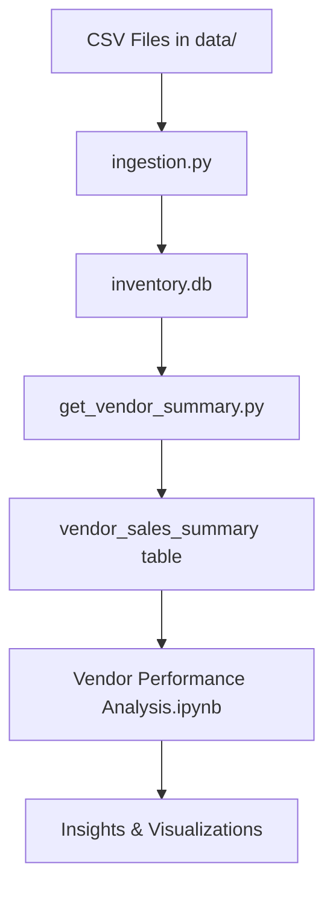

# Vendor Performance Analysis

A comprehensive data analysis project for evaluating vendor performance in inventory management, analyzing sales patterns, purchase trends, and profitability metrics.

## 📋 Table of Contents
- [Overview](#overview)
- [Project Structure](#project-structure)
- [Features](#features)
- [Installation](#installation)
- [Usage](#usage)
- [Data Description](#data-description)
- [Analysis Components](#analysis-components)
- [Troubleshooting](#troubleshooting)
- [Requirements](#requirements)

## 🎯 Overview

This project provides a complete pipeline for vendor performance analysis, including:
- Data ingestion from CSV files into SQLite database
- Data cleaning and transformation
- Vendor summary generation with calculated metrics
- Exploratory data analysis with visualizations
- Statistical analysis and insights

## 📁 Project Structure

```
Vendor Performance/
│
├── data/                           # Raw data files
│   ├── begin_inventory.csv
│   ├── end_inventory.csv
│   ├── purchase_prices.csv
│   ├── purchases.csv
│   ├── sales.csv
│   └── vendor_invoice.csv
│
├── logs/                           # Log files
│   ├── ingestion_db.log
│   └── vendor_summary.log
│
├── ingestion.py                    # Data ingestion script
├── get_vendor_summary.py           # Vendor summary generation script
├── Vendor Performance Analysis.ipynb  # Main analysis notebook
├── Exploratory Data Analysis.ipynb    # EDA notebook
├── app.ipynb                       # Application notebook
├── inventory.db                    # SQLite database
└── README.md                       # This file
```

## ✨ Features

### Data Processing
- **Automated Data Ingestion**: Load multiple CSV files into SQLite database
- **Data Cleaning**: Handle missing values, data type conversions, and text normalization
- **Calculated Metrics**: Automatically compute:
  - Gross Profit
  - Profit Margin
  - Stock Turnover
  - Sales to Purchase Ratio

### Analysis Capabilities
- Vendor performance comparison
- Sales trend analysis
- Purchase pattern evaluation
- Freight cost analysis
- Profitability metrics
- Statistical testing (t-tests, correlation analysis)

### Visualizations
- Distribution plots
- Correlation heatmaps
- Vendor comparison charts
- Time series analysis
- Performance dashboards

## 🚀 Installation

### Prerequisites
- Python 3.8 or higher
- pip package manager

### Step 1: Clone or Download the Project
```bash
cd "C:\D drive\Vendor Performance"
```

### Step 2: Install Required Packages
```bash
python -m pip install matplotlib pandas seaborn scikit-learn numpy scipy
```

Or install from requirements file:
```bash
pip install -r requirements.txt
```

## 📊 Usage

### 1. Data Ingestion
First, load the raw CSV data into the SQLite database:

```bash
python ingestion.py
```

This will:
- Read all CSV files from the `data/` directory
- Create tables in `inventory.db`
- Log the process in `logs/ingestion_db.log`

### 2. Generate Vendor Summary
Create the vendor summary table with calculated metrics:

```bash
python get_vendor_summary.py
```

This will:
- Merge data from multiple tables
- Calculate performance metrics
- Clean and transform data
- Create `vendor_sales_summary` table
- Log the process in `logs/vendor_summary.log`

### 3. Run Analysis
Open and run the Jupyter notebooks:

```bash
jupyter notebook "Vendor Performance Analysis.ipynb"
```

Or use VS Code / JupyterLab to open the notebooks.

## 📈 Data Description

### Input Data Files

| File | Description |
|------|-------------|
| `purchases.csv` | Purchase transactions with vendor details, quantities, and prices |
| `sales.csv` | Sales transactions including quantities, prices, and taxes |
| `vendor_invoice.csv` | Vendor invoices with freight costs |
| `purchase_prices.csv` | Product pricing information |
| `begin_inventory.csv` | Starting inventory levels |
| `end_inventory.csv` | Ending inventory levels |

### Database Schema

#### vendor_sales_summary Table
The main analysis table with the following columns:

| Column | Type | Description |
|--------|------|-------------|
| VendorNumber | INTEGER | Unique vendor identifier |
| VendorName | TEXT | Vendor company name |
| Brand | INTEGER | Product brand code |
| Description | TEXT | Product description |
| PurchasePrice | FLOAT | Price paid to vendor |
| ActualPrice | FLOAT | Retail price |
| Volume | FLOAT | Product volume/size |
| TotalPurchasedQuantity | INTEGER | Total units purchased |
| TotalPurchasedDollars | FLOAT | Total purchase cost |
| TotalSalesQuantity | FLOAT | Total units sold |
| TotalSalesDollars | FLOAT | Total sales revenue |
| TotalSalesPrice | FLOAT | Aggregate sales price |
| TotalExciseTax | FLOAT | Total excise tax collected |
| FreightCost | FLOAT | Shipping/freight costs |
| **GrossProfit** | FLOAT | Sales - Purchase cost |
| **ProfitMargin** | FLOAT | (Gross Profit / Sales) × 100 |
| **StockTurnover** | FLOAT | Sales Qty / Purchase Qty |
| **SalestoPurchaseRatio** | FLOAT | Sales $ / Purchase $ |

## 🔍 Analysis Components

### 1. Exploratory Data Analysis
- Summary statistics
- Data distribution analysis
- Missing value assessment
- Outlier detection

### 2. Vendor Performance Metrics
- Top performing vendors by revenue
- Profit margin analysis
- Stock turnover rates
- Freight cost efficiency

### 3. Statistical Analysis
- Correlation analysis between metrics
- Hypothesis testing
- Comparative analysis
- Trend identification

### 4. Visualizations
- Vendor comparison charts
- Profit margin distributions
- Sales vs. Purchase analysis
- Freight cost analysis

## 🔧 Troubleshooting

### Common Issues and Solutions

#### Issue 1: NameError in get_vendor_summary.py
**Error**: `NameError: name 'vendor_sales_summary' is not defined`

**Solution**: This was fixed in the latest version. Make sure you're using the corrected `get_vendor_summary.py` where the `clean_data()` function uses `df` instead of `vendor_sales_summary`.

#### Issue 2: Database columns not found
**Error**: `DatabaseError: no such column: GrossProfit`

**Solution**: Re-run the data pipeline:
```bash
python get_vendor_summary.py
```

#### Issue 3: Package installation errors
**Error**: Issues with `sklearn` package

**Solution**: Use `scikit-learn` instead:
```bash
python -m pip install scikit-learn
```

#### Issue 4: FutureWarning about fillna
**Warning**: `Downcasting object dtype arrays on .fillna`

**Solution**: This is a warning, not an error. The code will still work. To suppress:
```python
import warnings
warnings.filterwarnings('ignore')
```

### Log Files
Check log files for detailed error information:
- `logs/ingestion_db.log` - Data ingestion logs
- `logs/vendor_summary.log` - Vendor summary generation logs

## 📦 Requirements

```
pandas>=2.0.0
numpy>=1.24.0
matplotlib>=3.7.0
seaborn>=0.12.0
scikit-learn>=1.3.0
scipy>=1.10.0
jupyter>=1.0.0
```

## 🔄 Workflow



## 📝 Notes

- The database uses SQLite, which is file-based and requires no server setup
- All calculated metrics are automatically generated during the vendor summary creation
- The analysis notebooks can be run independently after the data pipeline is complete
- Log files are appended to, not overwritten, so you can track historical runs

## 🐛 Known Issues

1. **FutureWarning**: The `fillna()` method generates a deprecation warning in newer pandas versions. This doesn't affect functionality.
2. **Path with Spaces**: If your project path contains spaces (like "D drive"), always use quotes in command line.

## 💡 Tips

- Run `ingestion.py` whenever you update the CSV files
- Run `get_vendor_summary.py` after ingestion to refresh calculated metrics
- Use the log files to debug any issues
- The notebooks include inline documentation and comments

## 📧 Support

For issues or questions:
1. Check the log files in the `logs/` directory
2. Review the Troubleshooting section above
3. Ensure all required packages are installed
4. Verify the database file exists and is not corrupted

---

**Last Updated**: November 2025
**Python Version**: 3.8+
**Database**: SQLite 3
